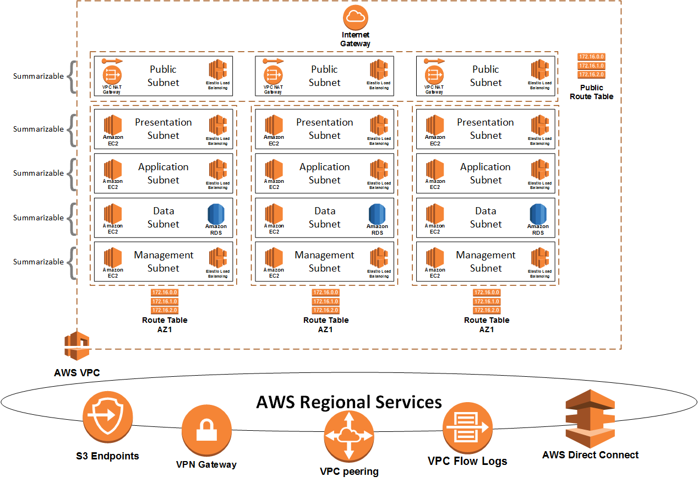

AWS VPC
=============



This module deploys an AWS VPC and all necessary components to prepare an environment for connectivity to the Internet and a Direct Connect circuit.

The goal of this project is to provide a streamlined, simple Terraform script to deploy and start running a network in AWS.

Testing comnpleted with Terraform v1.0.11

Example
------------
```
module "vpc" {
  source    = "git::https://github.com/fstuck37/terraform-aws-vpc2.git"
  region             = var.region
  vpc-cidrs          = var.vpc-cidrs
  name-vars          = var.name-vars
  subnets            = var.subnets
  zones              = var.zones
  tags               = var.tags
}

variable "region" {
  default = "us-east-1"
}
 
variable "vpc-cidrs" {
  default = ["10.0.0.0/21"]
}

variable "name-vars" {
  default = {
    account = "geek37"
    name    = "dev"
  }
}

variable "subnets" {
  default = {
    pub = "10.0.0.0/24"
    web = "10.0.1.0/24"
    app = "10.0.2.0/24"
    db  = "10.0.3.0/24"
    mgt = "10.0.4.0/24"
  }
}

variable "zones" {
  default = {
    us-east-1 = ["us-east-1a","us-east-1b"]
  }
}

variable "tags" {
  type = "map"
  default = {
    dept        = "Development"
    Billing     = "12345"
    Contact     = "F. Stuck"
    Environment = "POC"
    Notes       = "This is a test environment"
  }
}

```

Argument Reference
------------
   * **region** - Optional : The AWS Region to deploy the VPC to. Defaults to us-east-1	string
   * **zones** - Optional : AWS Regions and Availability Zones	map(list(string))
   * **vpc-cidrs** - Required : List of CIDRs to apply to the VPC.	list(string)
   * **name-vars** - Required : Map with two keys account and name. Names of elements are created based on these values.	map(string)
   ```
      variable "name-vars" {
        type = map(string)
        default = {
          account = "geek37"
          name = "dev"
        }
      }
   ```

   * **subnets** - Optional : Keys are used for subnet names and values are the subnets for the various layers. These will be divided by the number of AZs based on ceil(log(length(var.zones[var.region]),2)). 'pub' is the only special name used for the public subnet and must be specified first.	map(string)
   ```
   variable "subnets" {
     type = map(string)
     default = {
       pub = "10.0.0.0/24"
       web = "10.0.1.0/24"
       app = "10.0.2.0/24"
       db  = "10.0.3.0/24"
       mgt = "10.0.4.0/24"
     }
   }
   ```
   * **fixed-subnets** - Optional : Keys must match keys in subnets and values are the list of subnets for each AZ. The number of subnets specified in each list needs to match the number of AZs. 'pub' is the only special name used.	map(list(string))
   * **fixed-name** - Optional : Keys must match keys in subnets and values are the name of subnets for each AZ. The number of subnets specified in each list needs to match the number of AZs. 'pub' is the only special name used.	map(list(string))
   * **reserve_azs** - Optional : The number of subnets to compute the IP allocations for. If greater than the existing numnber of availbility zones in the zones list it will reserve space for additional subnets if less then it will only allocate for the existing AZs. The default is 0.	number
   * **pub_layer** - Optional : Specifies the name of the public layer. Defaults to pub.	string
   * **subnet-tags** - Optional : A map of maps of tags to assign to specifc subnet resource.  The key but be the same as the key in variable subnets.	map(map(string))

   * **tags** - Optional : A map of tags to assign to the resource.	map(string)
   * **resource-tags** - Optional : A map of maps of tags to assign to specifc resources. This can be used to override globally specified or calculated tags such as the name. The key must be one of the following: aws_vpc, aws_vpn_gateway, aws_subnet, aws_network_acl, aws_internet_gateway, aws_cloudwatch_log_group, aws_vpc_dhcp_options, aws_route_table, aws_route53_resolver_endpoint, aws_lb.	map(map(string))

   * **domain_name** - Optional : the suffix domain name to use by default when resolving non Fully Qualified Domain Names. In other words, this is what ends up being the search value in the /etc/resolv.conf file.	string
   * **domain_name_servers** - Optional : List of name servers to configure in /etc/resolv.conf. The default is the AWS nameservers AmazonProvidedDNS.	list(string)
   * **ntp_servers** - Optional : List of NTP servers to configure. The default is an emppty list.	list(string)
   
   * **enable_dns_hostnames** - Optional : A boolean flag to enable/disable DNS hostnames in the VPC. Defaults false.	bool
   * **enable_dns_support** - Optional : A boolean flag to enable/disable DNS support in the VPC. Defaults true.	bool
   * **instance_tenancy** - Optional : A tenancy option for instances launched into the VPC. Default is default, which makes your instances shared on the host. Using either of the other options (dedicated or host) costs at least $2/hr.	string
   * **vpc-name** - Optional : Override the calculated VPC name	string


   * **enable_route53_reverse_zones** - Optional : A boolean flag to enable/disable creation of reverse DNS zones for all /24 networks in the VPC. Anything smaller than a /24 will be ignored. Default is false	bool
   * **enable_route53_shared_resolver_rules** - Optional : Enable Route53 resolver rule associations. Defaults to false	bool
   * **exclude_resolver_rule_ids** - Optional : A list of resolve rule IDs to exclude from the resolve rule associations.	list(string)
   * **enable_route53_outbound_endpoint** - Optional : A boolean flag to enable/disable Route53 Outbound Endpoint. Defaults false.	bool
   * **enable_route53_inbound_endpoint** - Optional : A boolean flag to enable/disable Route53 Resolver Endpoint. Defaults false.	bool
   * **route53_resolver_endpoint_cidr_blocks** - Optional : A list of the source CIDR blocks to allow to commuicate with the Route53 Resolver Endpoint. Defaults 0.0.0.0/0.	list(string)
   * **route53_resolver_endpoint_subnet** - Optional : The subnet to install Route53 Resolver Endpoint , the default is mgt but must exist as a key in the variable subnets.	string
   * **route53_resolver_rules** - Optional : List of Route53 Resolver Rules	list{object({...})
   ```
   variable "route53_resolver_rules" {
     default =[
       {
          domain_name = "geek37.com"
          rule_type   = "FORWARD"
          name        = "geek37_com"
          target_ip   = {
            us-east-1 = [
              {
                ip = "10.0.0.1"
                port =53
              },
              {
                ip = "10.0.0.2"
              }
            ]
          }
          tags        = {
            example   = "Geek37.com DNS Forwarder"
          }
       }
     ]
   }
   ```
   * **default_route53_resolver_rules_target_ip** - Do not use : This defines the default values for each map entry in route53_resolver_rules target_ip. Do not override this.	map(string)
   * **default_route53_resolver_rules** - Do not use : This defines the default values for each map entry in route53_resolver_rules. Do not override this.	map(object({...})

   * **enable_vpn_gateway** - Optional : Create a new VPN Gateway. Defaults to true.	bool
   * **dx_gateway_id** - Optional : specify the Direct Connect Gateway ID to associate the VGW with.	string
   * **dx_bgp_default_route** - Optional : A boolean flag that indicates that the default gateway will be advertised via bgp over Direct Connect and causes the script to not default routes to the NAT Gateways.	bool
   * **transit_gateway_id** - Optional : specify the Transit Gateway ID within the same account to associate the VPC with.	string
   * **transit_gateway_routes** - Optional : specify the list of CIDR blocks to route to the Transit Gateway.	list(string)
   * **txgw_layer** - Optional : Specifies the name of the layer to connect the TXGW to. Defaults to mgt.	string
   * **appliance_mode_support** - (Optional) : Whether Appliance Mode support is enabled. If enabled, a traffic flow between a source and destination uses the same Availability Zone for the VPC attachment for the lifetime of that flow. Valid values: disable, enable. Default value: disable.	string


   * **override_default_security_group** - Optional : Takes over the rule set of the VPC's default Security Group and removes all rules. Defaults false.	bool
   * **block_tcp_ports** - Optional : Ports to block both inbound and outbound in the Public Subnet NACL.	list(string)
   * **block_udp_ports** - Optional : Ports to block both inbound and outbound in the Public Subnet NACL.	list(string)
   * **network_acl_rules** - Optional : Map of Map of ingress or egress rules to add to Public Subnet's NACL.	map(object({...})

   * **deploy_natgateways** - Optional : Set to true to deploy NAT gateways if pub subnet is created. Defaults to false.	bool
   * **enable_pub_route_propagation** - Optional : A boolean flag that indicates that the routes should be propagated to the pub routing table. Defaults to False.	bool

   * **enable_flowlog** - Optional : A boolean flag to enable/disable VPC flowlogs.	bool
   * **aws_lambda_function_name** - Optional : Lambda function name to call when sending to logs to an external SEIM.	string
   * **flow_log_filter** - Optional : CloudWatch subscription filter to match flow logs.	string
   * **flow_log_format** - Optional : VPC flow log format.	string
   * **cloudwatch_retention_in_days** - Optional : Number of days to keep logs within the cloudwatch log_group. The default is 7 days.	number

   * **amazonaws-com** - Optional : Ability to change principal for flowlogs from amazonaws.com to amazonaws.com.cn.	string

   * **enable-s3-endpoint** - Optional : Enable the S3 Endpoint	bool
   * **enable-dynamodb-endpoint** - Optional : Enable the DynamoDB Endpoint	bool
   * **private_endpoints** - Optional : List of Maps for private AWS Endpoints Keys: name[Name of Resource IE: s3-endpoint], service[The Service IE: com.amazonaws.<REGION>.execute-api, <REGION> will be replaced with VPC Region], List of security_group IDs, List of subnet layers or Subnet IDs to deploy interfaces to. When layer is used all subnets in each layer will be used. This can cause errors if the endpoint is not available in the AZ. Use subnet IDs if this happens.	list(object({...}))
   ```
   variable "private_endpoints" {
     type        = list(object({
       name                = string
       subnets             = list(string)
       service             = string
       security_groups     = list(string)
       private_dns_enabled = bool
     }))
     default = [
        {
            name                = "storage-gateway-endpoint"
            subnets             = ["mgt"]
            service             = "com.amazonaws.<REGION>.storagegateway"
            security_group      = "sg-123456789"
            private_dns_enabled = true
        },
        {
            name                = "execute-api-endpoint"
            subnet              = ["subnet-1234567890abcdef12"]
            service             = "com.amazonaws.<REGION>.execute-api"
            security_group      = "sg-123456789|sg-987654321"
            private_dns_enabled = true
        }
      ]
    }
   ```
   * **peer_requester** - Optional : Map of maps of Peer Link requestors. The key is the name and the elements of the individual maps are peer_owner_id, peer_vpc_id, peer_cidr_blocks (list), and allow_remote_vpc_dns_resolution.	map(object({...}))
   ```
   variable "peer_requester" {
     type        = map(object({
       peer_owner_id                   = string
       peer_vpc_id                     = string
       peer_cidr_blocks                = list(string)
       allow_remote_vpc_dns_resolution = bool
     }))

     default = {
       peer_owner_id                   = "1234567890123"
       peer_vpc_id                     = "vpc-0c23f7846a96a4723"
       peer_cidr_blocks                = ["10.1.0.0/21"]
       allow_remote_vpc_dns_resolution = true
     }
   }
   ```
   * **peer_accepter** - Optional : Map of maps of Peer Link accepters. The key is the name and the elements of the individual maps are vpc_peering_connection_id, peer_cidr_blocks (list), allow_remote_vpc_dns_resolution.	map(object({...}))
   ```
   variable "peer_accepter" {
     type = "map"
     default = {
       a_dev1 = "pcx-07be323735e1a8436|10.0.0.0/20"
     }
   }
   ```

   * **vpn_connections** - Optional : A map of a map with the settings for each VPN.  The key will be the name of the VPN	map(object({...}))
   * **default_vpn_connections** - Optional : This defines the default values for each map entry in vpn_connections. Only overide this if you want to change the defaults for all VPNs.	map(object(...))

Output Reference
------------
* **vpc_id** - string : The ID of the VPC
* **vpc_name** - string : The name of the VPC
* **subnet_ids** - map(list(string)) : Map with keys the same as subnets and value list of subnet IDs
* **routetable_ids** - map(list(string)) : 
* **account_id** - string : Account Number the VPC was deployed to.
* **available_availability_zone** - list(string) : List of teh available availability zones in the region.
* **aws_vpc** - Resource aws_vpc - [see](https://registry.terraform.io/providers/hashicorp/aws/latest/docs/resources/vpc)
* **aws_internet_gateway** - Resource aws_internet_gateway [see](https://registry.terraform.io/providers/hashicorp/aws/latest/docs/data-sources/internet_gateway)
* **aws_s3_endpoint** - Resource aws_vpc_endpoint for S3 [see](https://registry.terraform.io/providers/hashicorp/aws/latest/docs/resources/vpc_endpoint)
* **aws_dynamodb_endpoint** - Resource aws_vpc_endpoint for DynamoDB [see](https://registry.terraform.io/providers/hashicorp/aws/latest/docs/resources/vpc_endpoint)
* **aws_vpc_endpoint** - Resource aws_vpc_endpoint for Interface Endpoints [see](https://registry.terraform.io/providers/hashicorp/aws/latest/docs/resources/vpc_endpoint)
* **aws_eip** - Resource aws_eip [see](https://registry.terraform.io/providers/hashicorp/aws/latest/docs/resources/eip)
* **aws_nat_gateway** - Resource aws_nat_gateway [see](https://registry.terraform.io/providers/hashicorp/aws/latest/docs/resources/nat_gateway)
* **aws_vpc_dhcp_options** - Resource aws_vpc_dhcp_options [see](https://registry.terraform.io/providers/hashicorp/aws/latest/docs/resources/vpc_dhcp_options)
* **aws_customer_gateway** - Resource aws_customer_gateway [see](https://registry.terraform.io/providers/hashicorp/aws/latest/docs/resources/customer_gateway)
* **aws_vpn_connection** - Resource aws_vpn_connection [see](https://registry.terraform.io/providers/hashicorp/aws/latest/docs/resources/vpn_connection)
* **aws_vpn_gateway** - Resource aws_vpn_gateway [see](https://registry.terraform.io/providers/hashicorp/aws/latest/docs/resources/vpn_gateway)
* **aws_network_acl** - Resource aws_network_acl [see](https://registry.terraform.io/providers/hashicorp/aws/latest/docs/resources/network_acl)
* **aws_vpc_peering_connection** - Resource aws_vpc_peering_connection [see](https://registry.terraform.io/providers/hashicorp/aws/latest/docs/resources/vpc_peering_connection)
* **aws_vpc_peering_connection_accepter** - Resource aws_vpc_peering_connection_accepter [see](https://registry.terraform.io/providers/hashicorp/aws/latest/docs/resources/vpc_peering_connection_accepter)
* **peerlink_accepter_routes** - list(map(string)) : Data used to create routes for accepted peer links.
* **peerlink_requester_routes** - list(map(string)) : Data used to create routes for requested peer links.
* **subnet_data** - list(object(...)) : Data used to create the subnets and other related items like routing tables.
* **nacl_rules** - map(object(...)) : Data used to create the Public Subnet Network Access Control List.
* **txgw_routes** - list(map(string)) : Data used to create routes that point to the Transit Gateway.
* **vpn_connection_routes** - list(map(string)) : Data used to create static routes that point VPN connections.
* **route53_reverse_zones** - list(string) : Data used to create Route53 reverse DNS zones.

